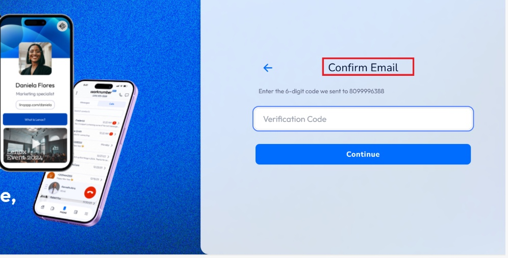

# QA Analyst Take-Home Assessment – Linq

This document includes all required deliverables for the Linq QA take-home challenge.

---

# QA Analyst Take-Home – Linq

## End-to-End Test Case: Create Profile and Save Contact Info

### Test Case ID: 12345
**Description:** Verify user is able to create a profile and save contact information in the Linq application.

---

**Steps and Expected Results:**

1. **Step:** Login to the Linq application as an authorized user  
   **Expected Result:** User is able to login to the Linq application  

2. **Step:** On Linq application, verify Phone number field is displayed  
   **Expected Result:** Phone number field is displayed  

3. **Step:** Do not enter a value in the phone number field and click Continue  
   **Expected Result:** Error "phone number is required" is displayed  

4. **Step:** Verify user is able to enter only numbers in the phone number field  
   **Expected Result:** Phone number field is numeric and user is not able to enter alphanumeric value  

5. **Step:** Enter more than 10 digits in the phone number and click on Continue  
   **Expected Result:** Error "please enter a valid phone number" is displayed  

6. **Step:** Enter a valid phone number and click on Continue  
   **Expected Result:** Sign up page is displayed  

7. **Step:** On Sign up page, Enter First and Last name, Email, and click on Continue  
   **Expected Result:** Phone number is autopopulated in the phone number field  
   **Then:** Professional details page is displayed  

8. **Step:** On Professional details page, select/enter the requested details and click Continue  
   **Expected Result:** Profile Image page is displayed  

9. **Step:** On Profile Image page, click Add Profile Image, take photo, save, and click Create Page  
   **Expected Result:** LinqOne page is displayed with Get Started button  

10. **Step:** Click Close on LinqOne page  
    **Expected Result:** Quick Actions are displayed with Edit Profile  

11. **Step:** Click Edit Profile and verify the profile details  
    **Expected Result:** Profile details are displayed correctly  

12. **Step:** Navigate to previous page and verify Add your first contact radio button is displayed under Next Steps  
    **Expected Result:** "Add your first contact" radio button is displayed  

13. **Step:** Select "Add your first contact" radio button  
    **Expected Result:** New Contact page is displayed  

14. **Step:** On New Contact page, enter requested details and click Save Changes  
    **Expected Result:** Contact info is saved successfully

---

# Bug Reports – Linq QA Analyst Take-Home

This document summarizes the bugs identified during the QA testing process.

---

### Bug #1: Incorrect Page Name for 6-Digit Code

**Steps to Reproduce:**
1. Login to the Linq application as an authorized user
2. Enter a phone number in the Phone Number field and click Continue
3. Observe the page where the user is supposed to enter the verification code

**Expected Result:**  
The page should display the title "Confirm Number"

**Actual Result:**  
The title displayed is "Confirm Email"




---

### Bug #2: Incorrect Page Redirect After Valid Phone Number Entry

**Steps to Reproduce:**
1. Login to the Linq application as an authorized user
2. Enter a valid phone number and click Continue
3. Observe the page redirection

**Expected Result:**  
The user should be directed to the "Confirm Number" page to enter the verification code

**Actual Result:**  
The user is redirected to the Sign Up page instead

---

### Bug #3: No Error for Overlength Phone Number Entry

**Steps to Reproduce:**
1. Login to the Linq application as an authorized user
2. Navigate to the New Contact page by completing profile setup
3. Enter more than 10 digits into the phone number field
4. Complete the form and click Save

**Expected Result:**  
An error message should appear stating that the phone number exceeds the allowed limit

**Actual Result:**  
The form accepts the input without any validation error

---

# Postman Notes – Linq QA Analyst Assessment

## 1. Linq Homepage API

- **Endpoint:** `https://api.linqapp.com/api/v1/linq_products`
- **Method:** GET
- **Status:** 200 OK
- **Description:** API returns product data from the Linq homepage. Used browser DevTools to inspect the GET request triggered on profile load.
- **Headers:** Standard `application/json` headers observed.
- **Payload:** Not applicable for GET request.
- **Response:** JSON containing product listings.

---

## 2. Saving a Contact API

- **Endpoint:** `https://api.linqapp.com/api/v1/users/create/`
- **Method:** POST
- **Headers:** Required headers include `'Content-Type: application/json'`. Authorization headers may be needed depending on API key configuration.
- **Request Body Example:**
```json
{
    "name": "Hruthik",
    "phone_number": "+19133269754",
    "email": "saihruthikeshreddy@gmail.com",
    "country_code": "us"
}
```
- **Response:** 200 OK or 400 Bad Request if validation fails (e.g., duplicate phone or email).
- **Note:** Both email and phone number must be unique. Creating a new user requires fresh data each time.

---

## Findings & Questions

- Response codes are returned correctly based on input validity.
- No authorization headers were observed in some cases, which may imply public endpoint or missing auth requirements.
- It would be helpful to have detailed error messages in the response when data validation fails.

---

# Bonus – Linq QA Analyst Take-Home

## Suggested Process Improvements (as the First QA Hire)

1. **Establish a QA Test Case Repository**  
   Create a centralized repository (e.g., TestRail, Notion, Confluence, or GitHub) for maintaining reusable test cases. This ensures consistent regression testing coverage and visibility into QA planning.

2. **Introduce a QA Sign-Off Process**  
   Implement a formal QA sign-off checklist before code moves to production. Include UI validations, API contract tests, and cross-browser/device compatibility.

3. **Automated Smoke Testing**  
   Set up a minimal suite of smoke tests using tools like Postman/Newman or Playwright/Cypress to validate critical workflows post-deployment. These can run on staging and production to catch early regressions.

---

## Exploratory Testing Approach

My approach to exploratory testing is structured but flexible, combining the following steps:

- **Charter-Based Exploration:**  
  I define testing charters such as "Explore Save Contact functionality for edge cases" and timebox sessions (e.g., 30-60 mins). This gives focus while allowing freedom to investigate dynamically.

- **Note-Taking & Mind Maps:**  
  I document ideas, paths tested, and any interesting behaviors using tools like XMind or pen-and-paper. This keeps a traceable log and helps identify gaps in test coverage.

- **Persona-Based Scenarios:**  
  I test as various user personas—new user, power user, mobile-first user—to identify usability flaws or overlooked logic.

- **Observability-Driven:**  
  I keep browser dev tools open, monitor network calls, console logs, and local/session storage changes during testing. This often reveals silent failures or backend/API mismatches.

- **Bug Taxonomy Awareness:**  
  I explore functional, UI/UX, performance, and security issues actively, not just the "happy path."

Exploratory testing helps uncover real-world issues that scripted testing often misses. It complements structured testing by bringing creative and critical thinking into the QA process.
