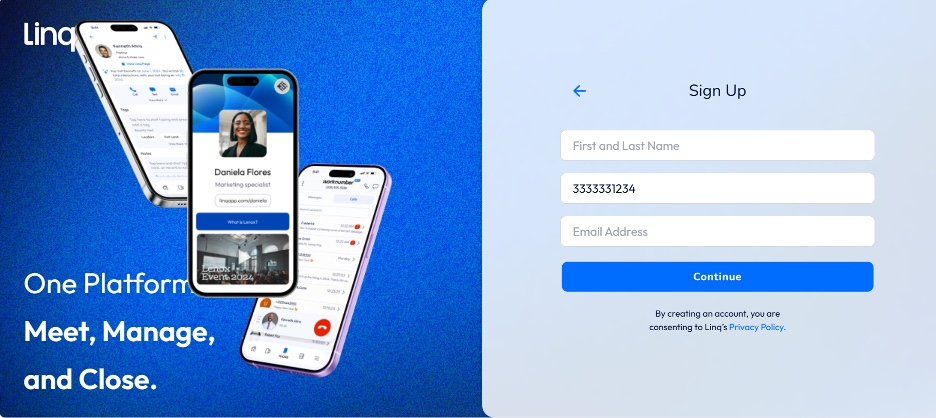
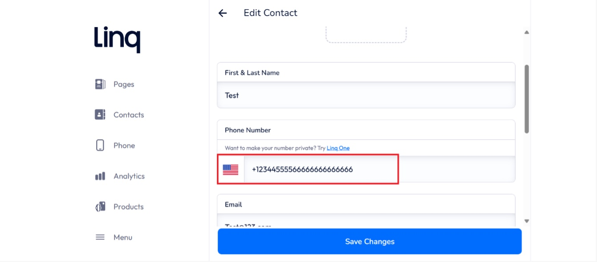

# Bug Reports – Linq QA Analyst Take-Home

This document summarizes the bugs identified during the QA testing process.

---

### Bug #1: Incorrect Page Name for 6-Digit Code

**Steps to Reproduce:**

1. Login to the Linq application as an authorized user
2. Enter a phone number in the Phone Number field and click Continue
3. Observe the page where the user is supposed to enter the verification code

**Expected Result:**  
The page should display the title "Confirm Number"

**Actual Result:**  
The title displayed is "Confirm Email"

---

### Bug #2: Incorrect Page Redirect After Valid Phone Number Entry

**Steps to Reproduce:**

1. Login to the Linq application as an authorized user
2. Enter a valid phone number and click Continue
3. Observe the page redirection

**Expected Result:**  
The user should be directed to the "Confirm Number" page to enter the verification code

**Actual Result:**  
The user is redirected to the Sign Up page instead

---

### Bug #3: No Error for Overlength Phone Number Entry

**Steps to Reproduce:**

1. Login to the Linq application as an authorized user
2. Navigate to the New Contact page by completing profile setup
3. Enter more than 10 digits into the phone number field
4. Complete the form and click Save
   
   **Expected Result:**  
    An error message should appear stating that the phone number exceeds the allowed limit

**Actual Result:**  
The form accepts the input without any validation error
