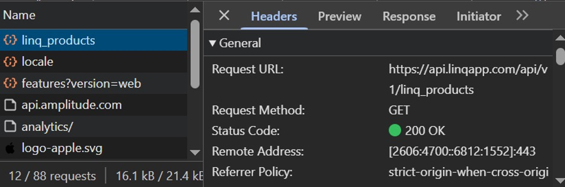
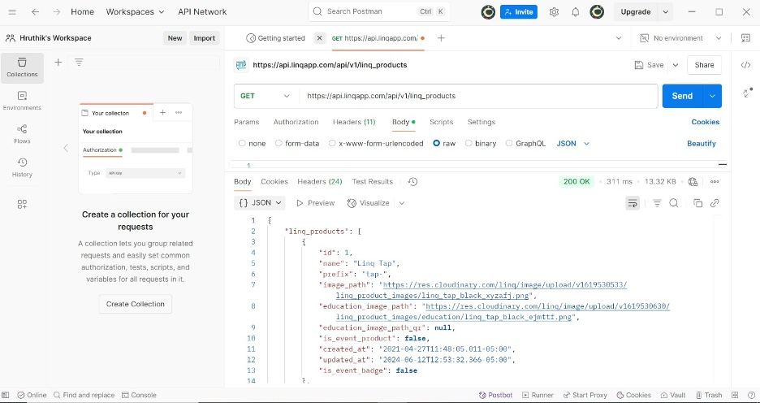
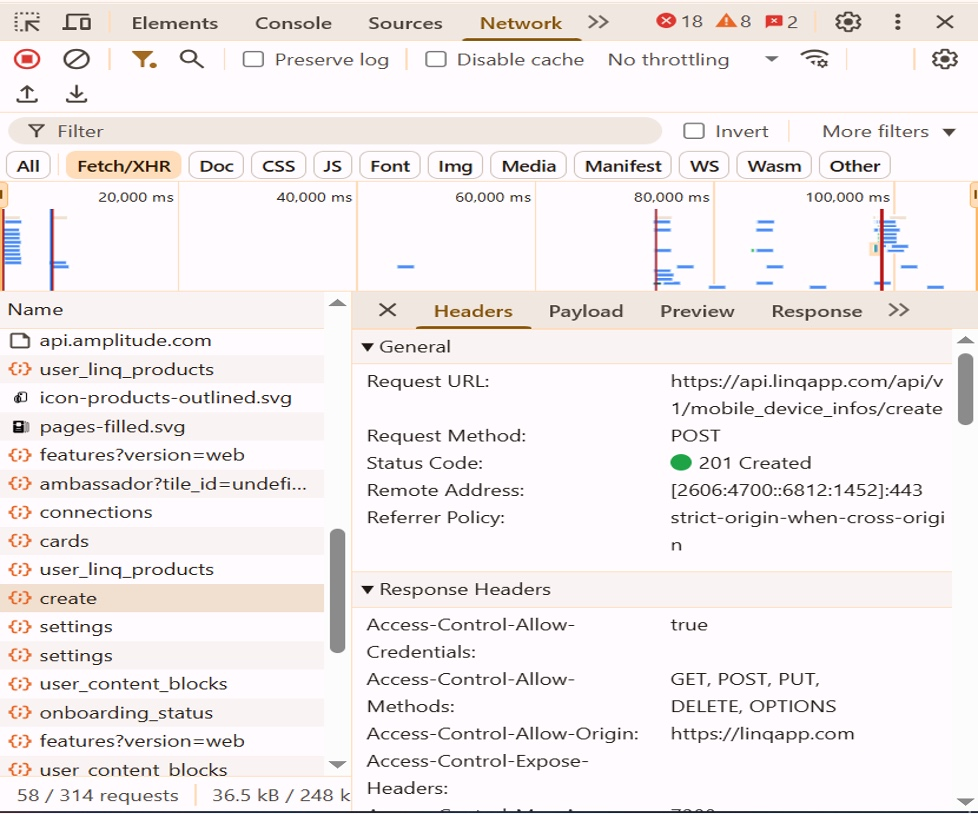
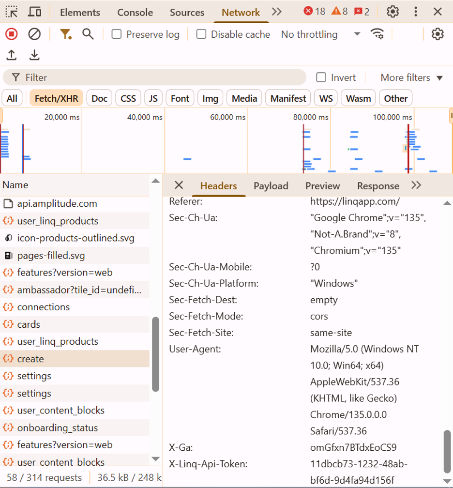
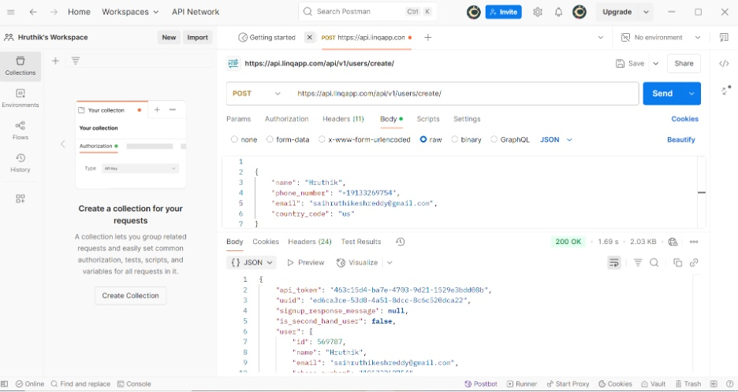

# Postman Notes – Linq QA Analyst Assessment

## 1. Linq Homepage API

- **Endpoint:** `https://api.linqapp.com/api/v1/linq_products`
- **Method:** GET
- **Status:** 200 OK
- **Description:** API returns product data from the Linq homepage. Used browser DevTools to inspect the GET request triggered on profile load.
- **Headers:** Standard `application/json` headers observed.
- **Payload:** Not applicable for GET request.
- **Response:** JSON containing product listings.
   

---

## 2. Saving a Contact API

- **Endpoint:** `https://api.linqapp.com/api/v1/users/create/`
- **Method:** POST
- **Headers:** Required headers include `'Content-Type: application/json'`. Authorization headers may be needed depending on API key configuration.
- **Request Body Example:**

```json
{
  "name": "Hruthik",
  "phone_number": "+19133269754",
  "email": "saihruthikeshreddy@gmail.com",
  "country_code": "us"
}
```

  

- **Response:** 200 OK or 400 Bad Request if validation fails (e.g., duplicate phone or email).
- **Note:** Both email and phone number must be unique. Creating a new user requires fresh data each time.

---

## Findings & Questions

- Response codes are returned correctly based on input validity.
- No authorization headers were observed in some cases, which may imply public endpoint or missing auth requirements.
- It would be helpful to have detailed error messages in the response when data validation fails.
